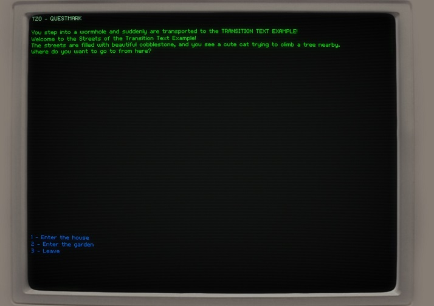

# Tzo-C 💎

This is an implementation of the [Tzo Virtual Stack Machine](https://github.com/jorisvddonk/tzo) in C.

Additionally, there's a [Questmark interpreter](https://github.com/jorisvddonk/questmark), too, with fancy rendering via [dos-like](https://github.com/mattiasgustavsson/dos-like)!

...I should probably spend some time on refactoring these out into separate projects... 😂

## Here be dragons!

There's absolutely guaranteed to be memory leaks in here as at the moment no variables on the Tzo stack are `free()`'d after use (I have to find a good working strategy for this still), so please don't use this for anything important!
