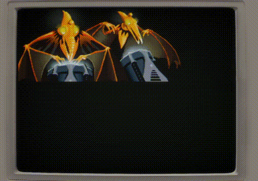

# Tzo-C 💎

This is an implementation of the [Tzo Virtual Stack Machine](https://github.com/jorisvddonk/tzo) in C.

Additionally, there's a [Questmark interpreter](https://github.com/jorisvddonk/questmark) (`questmark.c`), too, with fancy rendering via [dos-like](https://github.com/mattiasgustavsson/dos-like)!


There's also a TextureVM implementation as well (in `anim.c`):



...I should probably spend some time on refactoring these out into separate projects... 😂

## Here be dragons!

There's absolutely guaranteed to be memory leaks in here as at the moment no variables on the Tzo stack are `free()`'d after use (I have to find a good working strategy for this still), so please don't use this for anything important!

## compiling

Linux:

```sh
mkdir build
cd build
cmake ..
make
```

Windows, mingw32:

```powershell
mkdir build
cd build
cmake .. -G "MinGW Makefiles"
mingw32-make
```

Windows, Visual Studio 17 (2022):

```powershell
# note: need to run this in a VS Developer Command Prompt!
mkdir build
cd build
cmake .. -G "Visual Studio 17 2022"
msbuild ./tzo.sln
```

## compiling the other samples

To compile the other samples, use `-DBUILD_CONVO` or `-DBUILD_RCONVO` when generating te project files via cmake.
